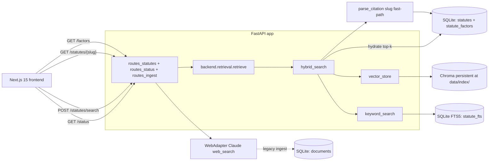
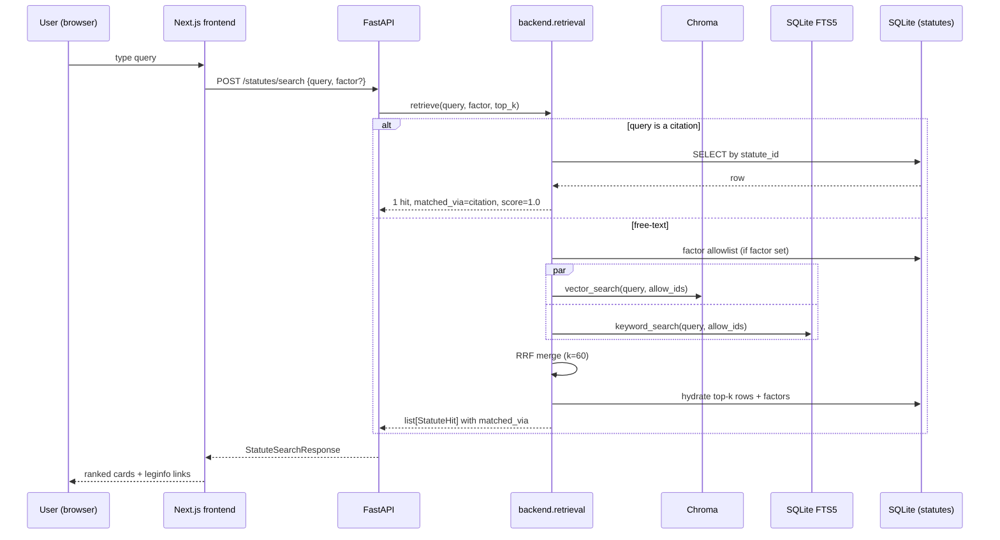

# Architecture (current state)

Delta notes describing **what is actually implemented in this repo right now**.

The baseline architecture doc (kept locally, not tracked) covers module roles, generic shapes, design system, and failure modes. The Phase-1 plan with timeboxes and per-person ownership lives in [docs/phase1_plan.md](phase1_plan.md). The user-facing API contract lives in [docs/api.md](api.md). This document is the bridge: a concrete map of what runs end-to-end today and what is still a stub.

---

## High-level system



---

## Implemented modules

### App entry — [backend/main.py](../backend/main.py)

- FastAPI app with CORS allowlisting `http://localhost:3000`.
- `lifespan` calls `init_db()` at startup so SQLite tables exist on first boot.
- `GET /healthz` — sanity ping.
- Mounts three routers: `routes_status`, `routes_ingest`, `routes_statutes`.

### Persistence — [backend/db.py](../backend/db.py), [backend/models.py](../backend/models.py)

SQLite + SQLAlchemy 2.x. Three tables:

| Table | Owner | Purpose |
|---|---|---|
| `documents` | legacy web ingest | Generic web/case-law row used by the existing `POST /ingest/*` flow. Reserved for the Phase-2 Organizer extension. |
| `statutes` | Phase-1 core | One row per vehicle-code section (with subdivision when present). Columns: `statute_id` slug, `jurisdiction`, `code_name`, `section_number`, `universal_citation`, `subdivision`, `division`, `chapter`, `statute_text`, `complete_statute`, `official_url`, `retrieved_at`. Unique on `(jurisdiction, code_name, section_number, subdivision)`. |
| `statute_factors` | Phase-1 core | Many-to-many tag from a statute to one of the 17 contributing-factor strings. `(statute_id, factor, confidence, quote)`. `quote` is required for traceability. |

All `statute_id` values are slugs of the shape `ca-veh-{section}` or `ca-veh-{section}-{subdivision}` — generated by `make_statute_id()` in [backend/retrieval/__init__.py](../backend/retrieval/__init__.py), which is the single source of truth so ingestion, retrieval, and the eval harness all produce the same slug.

### Configuration — [backend/config.py](../backend/config.py)

Frozen `Settings` dataclass loaded from env (with `python-dotenv` if present). Reads:

- `ANTHROPIC_API_KEY` — required for any Claude tool use (web search, future extraction).
- `DATABASE_URL` — defaults to `sqlite:///app.db`.
- `VECTOR_INDEX_PATH` — defaults to `data/index/`.
- Web-search defaults (`web_search_model`, `web_search_max_uses`) for the legacy ingest flow.

### Extraction taxonomy — [backend/extraction/factors.py](../backend/extraction/factors.py)

`ContributingFactor` enum + `FACTORS` tuple — the locked 17-category label space, byte-exact with the released CSV. Used by retrieval (factor pre-filter), the API (`/factors`, factor validation on `/statutes/search`), and the future tagger.

### Retrieval — [backend/retrieval/](../backend/retrieval/)

The retrieval pipeline is the heart of Phase 1. It exposes one entry point — `retrieve(query, factor=None, top_k=10) -> list[StatuteHit]` — and behind it runs:

1. **Citation fast-path** ([__init__.py](../backend/retrieval/__init__.py): `CITATION_REGEX`, `parse_citation`)
   `Cal. Veh. Code § 22350`, `22350(a)`, bare `22350` all resolve to a slug. If the slug hits a `Statute` row, return it with score `1.0` and skip retrieval. Guarantees citation recall@1 = 1.0 on the released CSV.
2. **Factor pre-filter (SQL)** ([hybrid_search.py](../backend/retrieval/hybrid_search.py): `_statute_ids_for_factor`)
   When a `factor` is supplied, build a `statute_id` allowlist from `statute_factors` and pass it to both backends. Empty allowlist returns no results — never silently ignored.
3. **Vector search** ([vector_store.py](../backend/retrieval/vector_store.py))
   Chroma persistent client, collection `ca_statutes`, cosine distance, default `all-MiniLM-L6-v2` embedder (no extra dep, no extra API key). Document text comes from `make_contextual_text(statute)` in [embeddings.py](../backend/retrieval/embeddings.py): `<code> § <section>(<subdivision>) [<division>; <chapter>]. <body>`. The contextual prefix is **deterministic**, not LLM-generated — re-indexing is free and traceable.
4. **Keyword search** ([keyword_search.py](../backend/retrieval/keyword_search.py))
   SQLite FTS5 virtual table `statute_fts(statute_id UNINDEXED, universal_citation, statute_text, complete_statute)`, tokenized `porter unicode61`, ranked by `bm25()`. User input is sanitized to quoted word-tokens before being passed to FTS5 to avoid query-syntax errors on stray punctuation. Sync strategy: rebuild from scratch — no triggers.
5. **RRF merge** ([hybrid_search.py](../backend/retrieval/hybrid_search.py): `_rrf_merge`)
   Reciprocal Rank Fusion with `k=60` (Cormack et al. 2009). Each ranking contributes `1 / (k + rank + 1)`; equal weights between vector and keyword for v1.
6. **Hydrate** ([hybrid_search.py](../backend/retrieval/hybrid_search.py): `_hydrate`, `_to_hit`)
   One SQL query loads the top-k `Statute` rows + their factors (via `selectinload`); RRF order is preserved. `matched_via` is set per hit to `citation` / `vector` / `keyword` / `hybrid` so the UI can badge semantic vs lexical hits.

The orchestrator function lives in [hybrid_search.py](../backend/retrieval/hybrid_search.py). The package re-exports `retrieve` lazily from [__init__.py](../backend/retrieval/__init__.py) so importing the type contract (`StatuteHit`, `parse_citation`, `make_statute_id`) doesn't pay the Chroma boot cost.

#### Index build CLI — [backend/retrieval/build.py](../backend/retrieval/build.py)

```bash
python -m backend.retrieval.build              # incremental upsert + FTS rebuild
python -m backend.retrieval.build --reset      # drop and rebuild Chroma too
```

Reads every row from `statutes`, calls `vector_store.upsert_statutes(...)` and `keyword_search.rebuild_fts(...)`. Idempotent. Designed to be the final step of any ingest run and the first step of any eval run.

### API — [backend/api/](../backend/api/)

Pydantic models live in [backend/api/schemas.py](../backend/api/schemas.py); they mirror `StatuteHit` 1:1 so route handlers are thin. Frontend reads [docs/api.md](api.md) as the contract.

| Endpoint | Owner | Behaviour |
|---|---|---|
| `GET /statutes/{statute_id}` | [routes_statutes.py](../backend/api/routes_statutes.py) | Exact slug lookup. Slug validated by `^[a-z0-9-]+$`; 400 on bad shape, 404 on miss. |
| `POST /statutes/search` | [routes_statutes.py](../backend/api/routes_statutes.py) | Body `{query, factor?, top_k}`. Calls `retrieve()`. Unknown `factor` → 400. |
| `GET /factors` | [routes_statutes.py](../backend/api/routes_statutes.py) | All 17 categories alphabetical with statute counts. Zero-count factors are still returned so the UI dropdown is stable. |
| `GET /status` | [routes_status.py](../backend/api/routes_status.py) | `indexed_documents`, `indexed_statutes`, `jurisdictions`, plus `last_eval_*` read defensively from `data/exports/eval_report.json`. |
| `POST /ingest/url`, `POST /ingest/search` | [routes_ingest.py](../backend/api/routes_ingest.py) | Legacy web ingest. Persists into `documents`, not `statutes`. Reserved for Phase-2 Organizer use. |

### Legacy ingest — [backend/ingestion/](../backend/ingestion/)

The pre-Phase-1 web pipeline still exists and works: `WebAdapter` uses Claude's `web_search_20250305` server tool to discover URLs, `httpx` to fetch them, and the `ingest_search` orchestrator to dedupe by URL before writing into `documents`. It is intentionally **not** wired to the statute pipeline — that ingest is Person 1's deliverable on a dedicated `CaStatuteAdapter` pulling from `leginfo.legislature.ca.gov` straight into the `statutes` table.

### Frontend — [frontend/](../frontend/)

Next.js 15 + React 19 + Tailwind. `app/page.tsx` lays out the three-column shell from baseline §7 (`SearchPanel` | `ResultsPanel` + `ComparisonTable` + `SourceViewer` | `VerificationPanel`), plus header `DatasetStatus` and a not-legal-advice footer. **Component bodies still return `null`.** Wiring against the four Phase-1 endpoints is Person 5's deliverable.

### Smoke tests — [backend/tests/test_retrieval_api.py](../backend/tests/test_retrieval_api.py)

15 unittest cases covering citation parsing, slug round-trips, factor enumeration, slug lookup (happy path + 400 + 404 + subdivision), citation fast-path, factor filter, free-text retrieval, and `/status`. Bootstraps a temp SQLite + temp Chroma index, seeds 7 CSV statutes, and exercises the live FastAPI app via `TestClient`. Run:

```bash
.venv\Scripts\python.exe -m unittest backend.tests.test_retrieval_api -v
```

First run downloads Chroma's default embedder (~80 MB) to the local cache. Subsequent runs finish in ~1 s.

---

## End-to-end Phase-1 flow



---

## What is still a stub

These files exist as one-line docstrings and are **deliberately deferred**:

- `backend/parsing/*` — `clean_text`, `chunk`, `pdf_parse`, `html_parse`. Person 1's CA statute adapter will own statute-shaped HTML parsing; longer chunking is not needed for vehicle-code sections.
- `backend/extraction/extract.py`, `backend/extraction/prompts.py` — Person 2's contributing-factor tagger.
- `backend/ingestion/adapters/canlii.py`, `pdf.py` — Phase-2 case-law adapters.
- `backend/reasoning/*` — `answer`, `compare`, `summarize`. No prose generation in Phase 1.
- `backend/verification/*` — `claims`, `verify`, `citations`. Verification badges become meaningful once Phase-2 introduces generated prose.
- `backend/api/routes_search.py`, `routes_answer.py`, `routes_verify.py` — superseded by `routes_statutes.py` for Phase 1; reserved for Phase 2.
- `openclaw/agent_prompt.md`, `openclaw/tools.json` — empty / heading-only. Agent tooling is Phase 2.

The stub policy from [CLAUDE.md](../CLAUDE.md) still applies: don't flesh these out without the user explicitly asking.

---

## Operational properties worth knowing

- **No new dependencies were added beyond [requirements.txt](../requirements.txt).** `chromadb` is already pinned; FTS5 ships with stock SQLite.
- **Re-indexing is cheap.** `make_contextual_text` is deterministic, so `python -m backend.retrieval.build --reset` rebuilds both indices in seconds for the expected ~1,500-row corpus.
- **Citation lookups never depend on retrieval quality.** The fast-path is a pure SQL hit on `statute_id`; broken embeddings can't degrade citation recall.
- **Slug normalization is centralized.** `make_statute_id` and `parse_citation` both live in [backend/retrieval/__init__.py](../backend/retrieval/__init__.py); ingestion (when Person 1 lands it) and the eval harness (Person 6) must call those — never roll a parallel implementation.
- **Factor strings are byte-exact.** No lowercasing, no aliasing on `/factors` or `/statutes/search`. The dropdown text and the request payload share one source.
- **`matched_via` provenance** is preserved through RRF and exposed on every hit; useful for the demo to call out "this hit was semantic" vs "this hit was an exact phrase".

---

## Pointers

- API contract → [docs/api.md](api.md)
- Phase-1 plan, role assignments, acceptance bar → [docs/phase1_plan.md](phase1_plan.md)
- Baseline architecture (the spec we're delta-noting against) → kept locally, not tracked in git
- Working-style rules → [CLAUDE.md](../CLAUDE.md)
